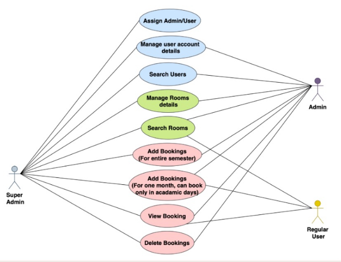
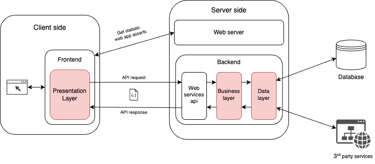

[comment]: # "This is the standard layout for the project, but you can clean this and use your own template"

# FoE Room Reservation

---

 
## Table of Contents
1. [Introduction](#introduction)
2. [Problem Domain](#problem-domain)
3. [User roles and functionalities](#User-roles-and-functionalities)
4. [Technology Stack](#technology-stack)
5. [Architecture](#architecture)
6. [Team](#team)
7. [Links](#links)

---

## Introduction

This platform has been developed simplify the process of booking lecture rooms within the Faculty of Engineering. We hope to create a seamless experience for lecturers and academic staff.

## Problem Domain
- 1. The current booking system allows users to book only seminar rooms. To book other rooms, users need to call the AR office.
- 2. Since bookings are managed through Office Outlook, it is difficult to handle them efficiently.
- 3. The current booking system is not user-friendly.

## User roles and functionalities

## Technology Stack
- #### Front end  - React
- #### Back end - Java (Spring Framework)
- #### Security - Spring Security, JWT
- #### Testing - Postman, Mockito
- #### Storage - MySQL

  

## Architecture

## Team
-  E/20/009, Ahemad I.I., [email](e20009@eng.pdn.ac.lk)
-  E/20/199, Ketharagan P., [email](e20199@eng.pdn.ac.lk)
-  E/20/338, Rishanthan S., [email](e20338@eng.pdn.ac.lk)
-  E/20/339, A.M.Rismy., [email](e20339@eng.pdn.ac.lk)

## Links

- [Project Repository](https://github.com/cepdnaclk/{{ page.repository-name }}){:target="_blank"}
- [Project Page](https://cepdnaclk.github.io/e20-co227-FoE-Room-Reservation){:target="_blank"}
- [Department of Computer Engineering](http://www.ce.pdn.ac.lk/)
- [University of Peradeniya](https://eng.pdn.ac.lk/)

[//]: # (Please refer this to learn more about Markdown syntax)
[//]: # (https://github.com/adam-p/markdown-here/wiki/Markdown-Cheatsheet)
